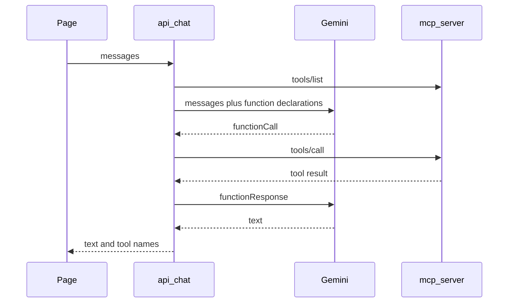

# Next.js chat client

One Next.js App Router app. The page posts the transcript to `POST /api/chat`. That route handler is the only caller of Gemini and the MCP server. No login, no session.



## Environment

- `GEMINI_API_KEY`
- `GEMINI_MODEL`, a Flash model id
- `MCP_URL`, default `http://127.0.0.1:3000/mcp`

The key is read only inside the route handler.

## Page

Client component. In-memory transcript of `{ role: "user" | "assistant", content: string }`. On send, `POST /api/chat` with that transcript. Append the returned text as the assistant message and show the returned tool names under that message.

Request: `{ messages: [{ role, content }] }`

Response: `{ content: string, tools: string[] }`

## Route to MCP

Server-side `fetch` to `MCP_URL`. Each call is one JSON body. Do not send `Authorization`. Do not call `GET` or `DELETE`.

Headers on every call:

- `Content-Type: application/json`
- `Accept: application/json, text/event-stream`
- `MCP-Protocol-Version: 2026-07-28`
- `Mcp-Method` set to the JSON-RPC method

Body:

```json
{
  "jsonrpc": "2.0",
  "id": 1,
  "method": "<method>",
  "params": {
    "_meta": {
      "io.modelcontextprotocol/protocolVersion": "2026-07-28",
      "io.modelcontextprotocol/clientInfo": { "name": "mcp-chat", "version": "0.1.0" },
      "io.modelcontextprotocol/clientCapabilities": {}
    }
  }
}
```

The response is one JSON object, not a stream. Use `result` when present.

`tools/list` returns `result.tools[]` with `name`, `description`, and `inputSchema`. Cache that list for the life of the process.

`tools/call` also sends header `Mcp-Name` equal to the tool name, plus `params.name` and `params.arguments` beside `_meta`.

A rejected argument is still HTTP 200. `result.isError` is `true` and `result.content` is an array of `{ type: "text", text }`. There is no JSON-RPC `error` in that case. An unknown tool is HTTP 200 with a JSON-RPC `error` (`code` `-32602`). Pass either outcome back to Gemini as the function result.

## Route to Gemini

`POST https://generativelanguage.googleapis.com/v1beta/models/{GEMINI_MODEL}:generateContent` with header `x-goog-api-key`.

Put the page transcript in `contents` (`user` and `model` roles, text parts). Put the cached MCP tools in `tools[0].functionDeclarations`: `name`, `description`, and `parameters` set to `inputSchema`.

Loop at most five times on one chat request:

- If the candidate content has a `functionCall` (`name`, `args`): run `tools/call` with those arguments. Append that model content, then a user content whose part is `functionResponse` with the same name and a `response` object holding the MCP `result` or JSON-RPC `error`.
- If the candidate content has text and no function call: stop. Return that text and the tool names called during this request.
